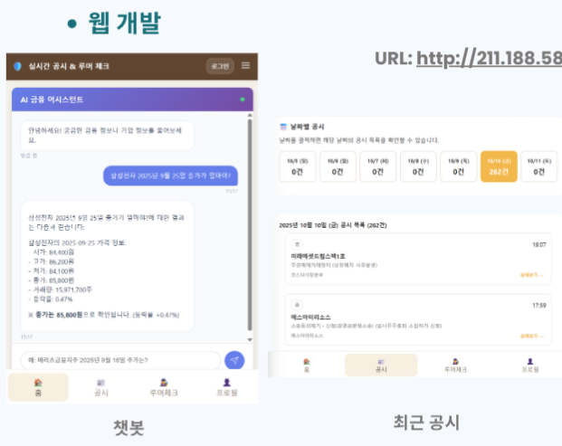
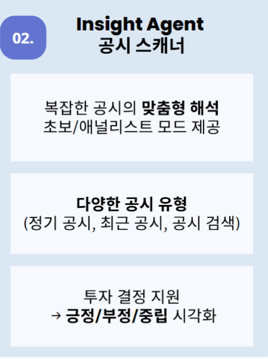

# Fin Guard AI - AI 정보 필터링 에이전트

## 프로젝트 개요
[**제9회 2025 미래에셋증권 AI Festival**](https://miraeassetfesta.com/) **최우수상** 수상작 (Tech 부문)  
개인투자자의 정보 격차 해소를 위한 Multi-Agent 기반 투자 의사결정 지원 시스템  
  
결선 발표 자료: [AI페스티벌_결선_발표자료_Fin에이전트.pdf](./assets/presentation.pdf)

## 핵심 기능

| Agent | 주요 기능 | 특징 |
|-------|----------|------|
| **Flow Agent** | 주가 검색 및 분석 | • 기본 조회 + Text2SQL 결합 • 기술적 지표 분석 (RSI, 볼린저밴드, 골든/데드크로스) • 조건별 검색 정확도 94% |
| **Insight Agent** | 공시 문서 분석 | • 28개 정기공시 항목 구조화 • 초보/애널리스트 모드 제공 • 3단계 회사명 매칭 시스템 |
| **Rumor Agent** | 정보 신뢰도 검증 | • 뉴스-공시 교차 검증 • 0-100% 신뢰도 점수 제공 • 병렬 처리로 빠른 응답 |

## 주요 특징
- Agent-to-Agent 아키텍처로 복잡한 질의를 순차·병렬 처리
- 실시간 데이터 수집 (NAVER News API, OpenDART API)
- HyperCLOVA X 기반 자연어 처리
- 투명하고 신뢰할 수 있는 검증 시스템

## 레포지토리

### Frontend
| [**FinGuardAI**](https://github.com/AI-Festival-2025-Fin-Agent/FinGuardAI) 웹 인터페이스 |
|--------|
|  |

### Orchestration
| [**A2A**](https://github.com/AI-Festival-2025-Fin-Agent/Multi-Agent) Agent-to-Agent 시스템 |
|--------|
|  |

### Agents
| [**Flow Agent**](https://github.com/AI-Festival-2025-Fin-Agent/Flow-Agent) 주가 검색 및 분석 | [**Insight Agent**](https://github.com/AI-Festival-2025-Fin-Agent/Insight-Agent) 공시 문서 분석 | [**Rumor Agent**](https://github.com/AI-Festival-2025-Fin-Agent/Rumor-Agent) 정보 신뢰도 검증 |
|--------|--------|--------|
|  |  |  |

## 기대 효과
- **정량적**: 투자 의사결정 속도 향상, 공시 분석 시간 단축, 허위 정보 판별
- **정성적**: 정보 격차 해소, 시장 건전성 제고, 금융 포용성 확대

## 데모
**URL**: http://211.188.58.94:8080/#home

---
**주최**: 미래에셋증권 Wealth Tech본부  
**결선 발표**: 2025년 10월 14일
